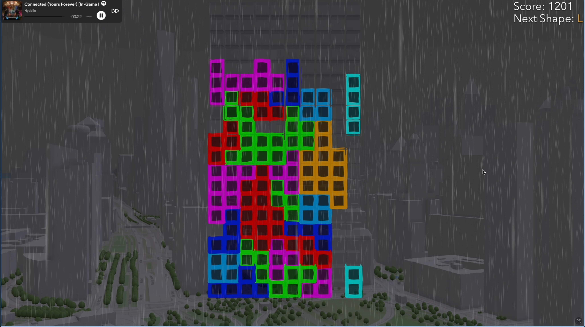
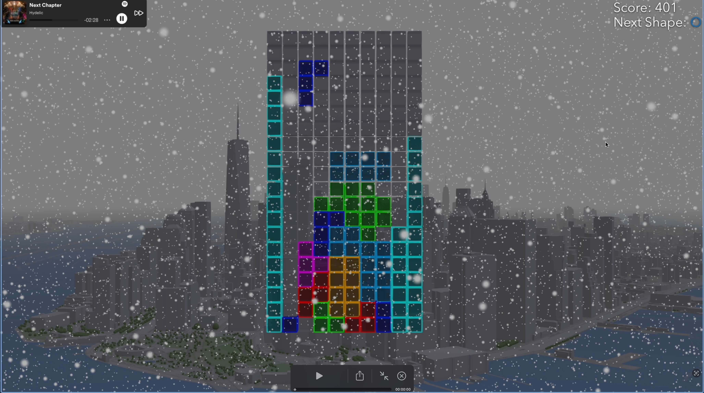
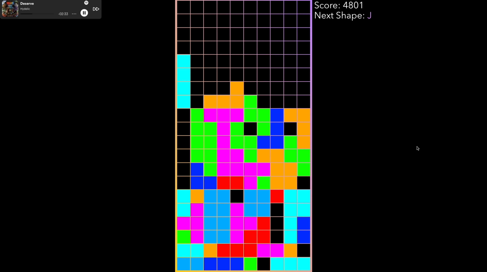

# Tetris React

A Tetris game with 3 unique maps.

[Trailer](https://youtu.be/LlDgH-NZ3KE)

[Play online](https://bit.ly/-tetris-react)

## Scenery World:

Hover over the waterfront park of the New York City.

[](https://youtu.be/LlDgH-NZ3KE)

## Panorama World:

Circle around the downtown of the New York City.

[](https://youtu.be/LlDgH-NZ3KE)

## Grid World:

Enjoy simple old-school tetris.

[](https://youtu.be/LlDgH-NZ3KE)

## Instructions

While playing, enjoy a curated playlist from an award-winning musical artist [Hydelic](https://open.spotify.com/artist/6agnjQgwC8fwGFsM6NKSaH). To enjoy music autoplay, make sure to sign in to your Spotify account.

[Technical documentation](https://max.patii.uk/projects/tetris-react)

## Installation

- Clone this repository:

  ```sh
  git clone https://github.com/maxxxxxdlp/tetris-react/
  ```

- Install dependencies:

  ```sh
  npm install
  ```

- Run the app:

  ```sh
  # For Development:
  npm run dev
  # For Production:
  npm run build && npm run start
  ```

## Credits

- Inspired by [Tetris Effect](https://youtu.be/PFVL6t8IHE8?si=qjVQxbNN9RQQmnud&t=21)
- In-game music composed by [Hydelic](https://open.spotify.com/artist/6agnjQgwC8fwGFsM6NKSaH)
- Boilerplate code based on [jsapi-resourcces/esm-samples](https://github.com/Esri/jsapi-resources/tree/main/esm-samples)
